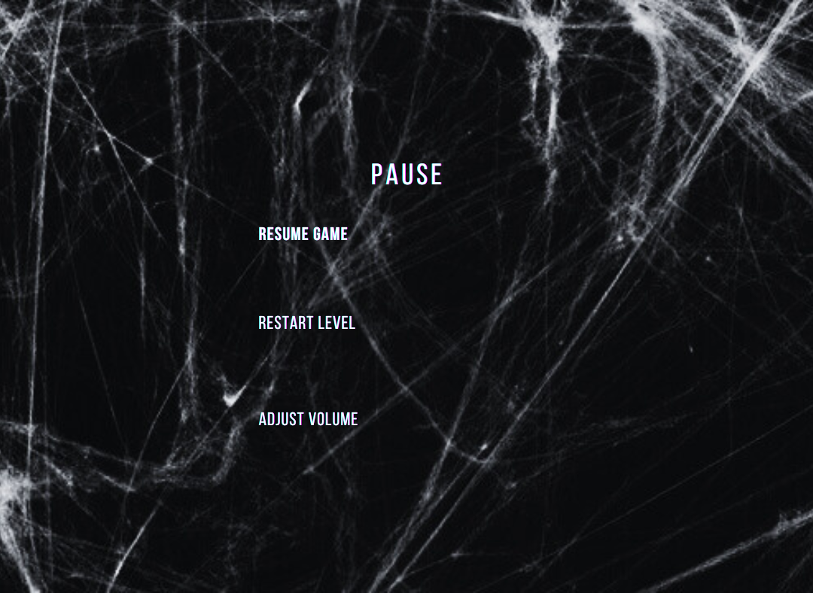

   
# Paranormal School: The Room 404 

## Game Design Document (GDD)

## Game Overview
https://youtu.be/66z0krdKnAU
### Core Concept: 
It is a game that happens at a school. A student ignores the hearsay and needs to take action to survive. She needs to find the road to escape. Player controls the character's movement and action.
### Related genre: 
escape, adventure, puzzle

## Story and Narrative
### Backstory
There is a scary rumour in Obayashi Royal Victoria School: “Never enter room 404 on the top floor! Someone died in there before”.
However, student Akane didn’t listen. She opened the door of the room and went in. The door suddenly closed and locked by itself. 

Then a notice appears. It says “Why didn’t you listen to the rule? You have now been removed from the real world, you will only have 7 minutes to get the key on the third floor and open this door again to escape. Otherwise, YOU WILL BE DISAPPEARED FOREVER, your student profile will become 404 NOT FOUND in the system and no one will notice. You will be locked in this room till the end of your life." 
After that, Akane will find herself on level 1. 

Akane will need to find the correct way and return to level 4 while passing through different classrooms at school. Meanwhile, she needs to be aware of some traps, such as preventing her from stepping into a red block and return back to the starting point of lv2. Player needs to find the key and unlock the door on level 4 to finish the game.

### Characters

Akane is the only character in the game and there is no villain or boss. Akane is a student in this school. 
To avoid being disappeared in the real world, she needs to find the correct way to escape in a limited time.

## Gameplay and Mechanics
### Player Perspective
It will be a third-person perspective with a fixed camera that always focuses on the player, while the angle is mainly above the ground so the character will be the main point shown on the screen. Player will be visible the whole time and controlled by the player.
### Controls
Move: W (forward), S (backward), A (left), D (right)

Jump: Space

Pick up: F

Jump into hole: J

Pause: P  
### Progression
* Game progress: There are different levels in the building and you need to find a way to escape. The difficulty of the game increases with each floor, the environment will become darker.
* Lose mechanism: Player failing to reach room 404 in 7 minutes is considered to be losing the game.
* Scoring system: 7-minute time limit. 
What makes the player want to keep playing: The idea that failing to escape within the time limit adds a sense of urgency and excitement to the player. Also, the unexpected events on each floor can keep the gameplay dynamic. As the player will need to adapt their strategies, this will keep the gameplay fresh and engaging.
4/F: Win if find the key in 3/F and open the door of 404
3/F: Find the key to open room 404
2/F: Parkour style, avoid stepping on the red blocks
1/F: Find the correct way and reach the next level
### Gameplay Mechanics
* Puzzle: Some doors or pathways may be blocked, requiring the player to find alternative routes or solve simple puzzles, such as moving objects or finding hidden switches, to progress
* Actions: parkour actions (jumping), avoiding stepping on red block (parkour), searching, choosing paths…
* Victory Condition: The player wins the game by reaching the fourth floor, finding the key on the third floor, and unlocking the door within the 7-minute time limit.
* The tension environment make the game fun

## Levels and World Design
### Game World 
It will be a 3D level-based game. There will be three levels. However, there isn’t any map for the player. Players can just navigate by themselves and remember the correct path. How the game world is captured on-screen depends on the player's perspective. The environment can be scrolled.
### Objects 
There will be one character moving across the game

The whole game will be escape room and parkour-based and the background will be elements at school. There will be a number of red blocks distributed on Lv2 ground. The character needs to complete this level in a Parkour style without stepping on the blocks. (Similar to Super Mario). The character needs to find the key to unlock the door on level 4 to finish the game. 

### Physics 
The physics of the game will mainly be based on the real world. The character will move like a normal human. There is a few interaction between players and npc. The only thing the character will do is find the correct path and pick up useful tools.

## Art and Audio

### Art Style 

Dark tones with occasional harsh reds and eerie greens to heighten tension. The interface uses minimalist design with a focus on functionality and atmosphere

The characters, environment and game assets are created to imitate the real world to provide a lively atmosphere for the players. The dark long dress and white hair emphasis the eerie atmosphere.

### Sound and Music
School bell: https://youtu.be/iV3Albwu_Ac?si=W_gyw29pLbhcdUsv

Entering 3/F search for key: https://youtu.be/DIQNT7-NMfI?si=65pJwF4pFakarXBA

Scare sounds: https://www.youtube.com/watch?v=MBsdB4ykpug

Suspense background: https://www.youtube.com/watch?v=KoxxBeH7J3Q

Wind: https://youtu.be/yMYRapTqHVM?si=toDtcDQv-TZYgCCo

Winning bell: https://youtu.be/qpn9VMABTas?si=E7BNE7rJ7lalYnmE

Door: https://youtu.be/D3ZuJ-I78yI?si=GTxLaIlM8Bk8M8hF
https://youtu.be/yO2ldAd78Yc?si=WUGoWsCNlE7Fp79H

Pick up paper
https://youtu.be/EuX-6t6ppzA?si=cN4RKa_TRnS9160S

Pick up key
https://youtu.be/i4ljfO1yzDk?si=XbB9Yf-mqnp5baZP

### Assets
Classroom setting: https://assetstore.unity.com/packages/3d/environments/japanese-school-corridor-19983

Skeleton model: https://sketchfab.com/3d-models/anatomically-correct-skeleton-3247ca2f8a6346d78142f193eeb59c88

Spider webs: https://skfb.ly/owIso

School chair: https://skfb.ly/oPqWM

Desk: https://skfb.ly/6unPU

White board: https://skfb.ly/oRytQ

Cardboard: https://skfb.ly/6BPKs

Green chair: https://skfb.ly/6WYsT

Clock: https://skfb.ly/6VJFL

EXIT sign: https://skfb.ly/DyTz

Messy file cabinet: https://skfb.ly/6oZwt

Teacher desk: https://skfb.ly/VUpU

Wet floor caution: https://skfb.ly/o6JAH

Cabinet: https://skfb.ly/owyMz

https://skfb.ly/oJNSU

Key: https://skfb.ly/oAqSG

Board: https://skfb.ly/oRFuZ

Bag: https://sketchfab.com/3d-models/old-soviet-backpack-bb89dfa7ec13478e85645497dfeafdcd

Bin: https://skfb.ly/p7QVC

## User Interface (UI)
1. Main Menu

   
   
   A dark, blurred school corridor with lights

   Start Game button - Large, centrally placed, glowing red to grab attention.

   
2. In-Game
   
   Timer - Top-left corner of the screen, displaying the 7-minute countdown

   No traditional health bar

   Pause menu (Press P to open)

   

   Settings Panel - On the top right corner, allows players to adjust settings (volume, resume game, restart level).

4. Interaction Prompts
   
   Contextual Prompts - When near an interactable object (like the key, door, or hole), a small prompt appears (“Press F” or "Press J").
   
   These prompts are in a white or red font, make it clear to the player, and to blend with the game’s eerie atmosphere.

5. Loading Screens

   
   
   
   A fully dark classroom creates a mysterious vibe

   Display gameplay hints for each level (e.g. "Not all paths lead to safety...")

6. Game Over Screen

   
   
   The screen fades to black with a "404 NOT FOUND" message in the center, mimicking a computer error screen

   with a melancholic background sound

   Options:

      Retry - Restarts the game from the beginning

7. Winning Screen

   

   Light classroom background with a classroom background noise
   the class photo on the wall indicating Akane prevented herself from disappearing

   Options:

      Retry - Restarts the game from the beginning

## Technology and Tools

Pictures:

https://unsplash.com/

https://www.pexels.com/

Sound Effect: Youtube

UI design: canva
